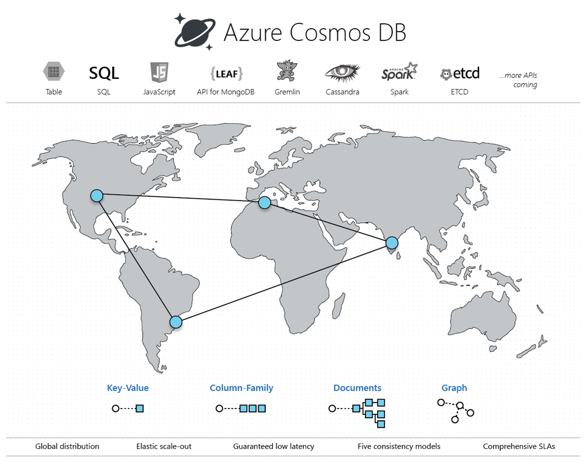
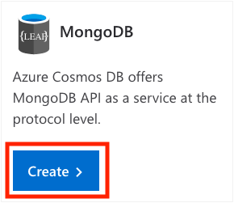
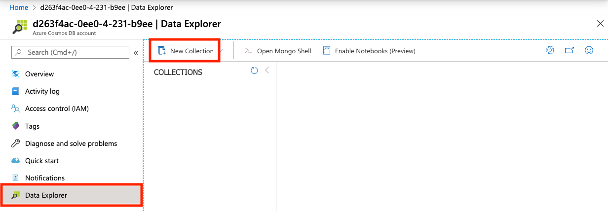
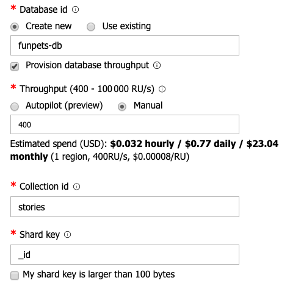
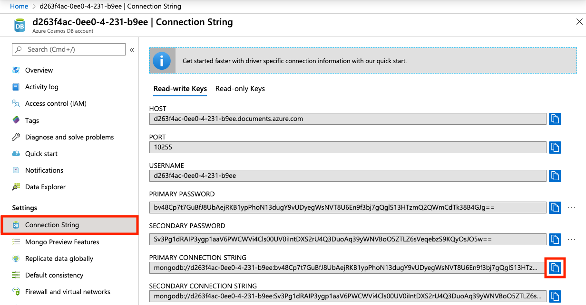
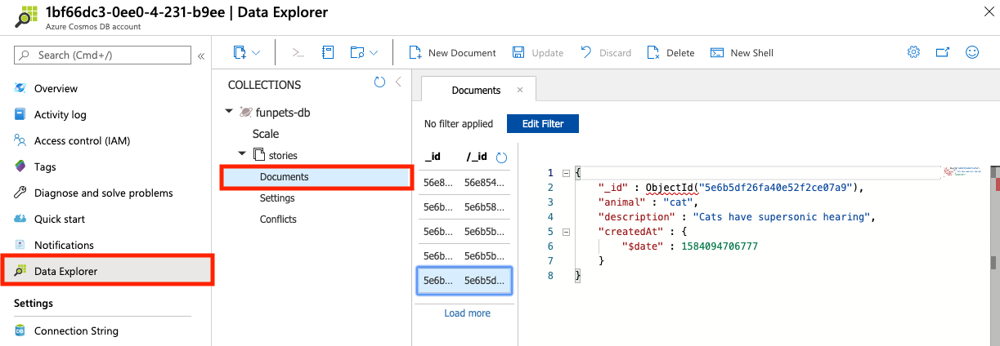
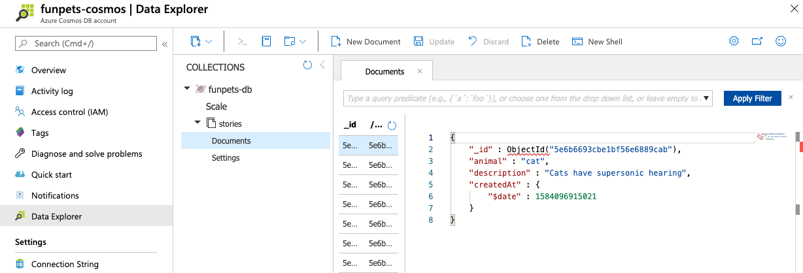

# 3. Add database

Now that we have everything set up for our application code and deployment, we can go on with the more serious stuff and add a database instead of using hardcoded data.

## Configure Cosmos DB

[Cosmos DB](https://azure.microsoft.com/services/cosmos-db/?WT.mc_id=nitro-workshop-yolasors) is a managed distributed NoSQL database that will allow you to save and retrieve data. It supports multiple data models and many well known database APIs, including [MongoDB](https://www.mongodb.com/) that we will use for our application.



First we have to create a Cosmos DB account, which can hold one or more databases.

If you are attending this workshop with an instructor or if you are short on time, you should use the first option **Use trial account**. The second option allows you to create a new account, which is a bit longer.

::::: tabs

:::: tab "Use trial account"
The quickest way to experiment with Cosmos DB is to use the [Try CosmosDB for free](https://azure.microsoft.com/try/cosmosdb/?WT.mc_id=nitro-workshop-yolasors) website, to get instant access to a pre-provisionned free account for 30 days (renewable).

1. Open the [Try CosmosDB for free](https://azure.microsoft.com/try/cosmosdb/?WT.mc_id=nitro-workshop-yolasors) website, then click on the MongoDB **Create** option:

    

2. Log in if needed, then once the database is ready click on the button **Open in Azure Portal**:

    

3. Click on the **Data Explorer** tab, then on the **New Collection** button:

    

4. Fill in the fields like this: 

    

    ::: tip Pro tip
    There are two things worth mentioning here:
    - We choose to share a provisioned throughput of [Request Units](https://docs.microsoft.com/azure/cosmos-db/request-units?WT.mc_id=nitro-workshop-yolasors) among all our collections within our database, using the checkbox `Provision database throughput`. This greatly helps to reduce costs when using a paid account.
    - We need to define a shard key (also called [partition key](https://docs.microsoft.com/azure/cosmos-db/partitioning-overview?WT.mc_id=nitro-workshop-yolasors#choose-partitionkey)) for the collection, to ensure proper [partitioning](https://docs.microsoft.com/azure/cosmos-db/partitioning-overview?WT.mc_id=nitro-workshop-yolasors). We use the default auto-generated `_id` property by MongoDB for that.
    :::

5. Finally, go to the `Connection strings` tab and click on the button next to your primary connection string to copy it:

    
::::
  
:::: tab "Create new account"

::: info Note
There is now a Free Tier for Cosmos DB that includes 5 GB storage and up to 25 collections, with production-grade performance and no expiration period (it's *free forever*!). If you want to use it, you need to create your Cosmos DB account using the [Azure Portal](https://ms.portal.azure.com/?WT.mc_id=nitro-workshop-yolasors#create/Microsoft.DocumentDB) instead of running the CLI command below (choose **MongoDB** for the API).
:::

We will use the Azure CLI command to create our new Cosmos DB account:

```sh
# Create a Cosmos DB account
# This name must be globally unique, so change it with your own
# This takes around ~10 min, so you can move on to the integration
# step meanwhile
az cosmosdb create --name <your-funpets-cosmos> \
                   --resource-group funpets \
                   --kind MongoDB
```

Once the account is created, we need do three more things before switching back to code:

1. Create the MongoDB database.

```sh
# Don't forget to change the account name with the one you used previously
az cosmosdb mongodb database create --account-name <your-funpets-cosmos> \
                                    --resource-group funpets \
                                    --throughput 400 \
                                    --name funpets-db
```

::: tip Pro tip
We choose to share a provisioned throughput of [Request Units](https://docs.microsoft.com/azure/cosmos-db/request-units?WT.mc_id=nitro-workshop-yolasors) among all our collections within our database, using the `--throughput` option. This greatly helps to reduce costs.
:::

2. Create the `stories` collection, where we will put our data.

```sh
# Don't forget to change the account name with the one you used previously
az cosmosdb mongodb collection create --account-name <your-funpets-cosmos> \
                                      --resource-group funpets \
                                      --database-name funpets-db \
                                      --name stories \
                                      --shard _id
```

::: tip Pro tip
We need to define a shard key (also called [partition key](https://docs.microsoft.com/azure/cosmos-db/partitioning-overview?WT.mc_id=nitro-workshop-yolasors#choose-partitionkey)) for the collection, to ensure proper [partitioning](https://docs.microsoft.com/azure/cosmos-db/partitioning-overview?WT.mc_id=nitro-workshop-yolasors). We use the default auto-generated `_id` property by MongoDB for that.
:::

3. Finally, we retrieve the connection string to connect our application to the database.

  ```sh
  # Don't forget to change the account name with the one you used previously
  az cosmosdb keys list --name <your-funpets-cosmos> \
                        --resource-group funpets \
                        --type connection-strings \
                        --query "connectionStrings[0].connectionString"
  ```
::::

:::::

Now edit the file `local.settings.json`, and add these properties to the `Values` list:
```json
"MONGODB_CONNECTION_STRING": "<your primary connection string>",
"MONGODB_DATABASE": "funpets-db",
```

Remove this line as it's not needed:
```json
"AzureWebJobsStorage": "",
```

These values will be exposed to our app as **environment variables** by the Functions runtime, to allow access to your database.

## Integrate with NestJS

You are now ready to use the database in your application. NestJS provides a great integration with [TypeORM](https://typeorm.io) which is the most mature Object Relational Mapper (ORM) available for TypeScript, so we will use that.

First, you have to install the a few more packages with this command:

```sh
npm install --save @nestjs/typeorm typeorm mongodb
```

Open the file `src/app.module.ts` and add `TypeOrmModule` to the module imports:
```ts
@Module({
  imports: [
    TypeOrmModule.forRoot({
      type: 'mongodb',
      url: process.env.MONGODB_CONNECTION_STRING,
      database: process.env.MONGODB_DATABASE,
      entities: [
        __dirname + '/**/*.entity{.ts,.js}',
      ],
      ssl: true,
      useUnifiedTopology: true,
      useNewUrlParser: true
    }),
    ...
  ]
```

Don't forget to add the missing import at the top:
```ts
import { TypeOrmModule } from '@nestjs/typeorm';
```

::: tip Pro tip
Using `process.env.<VARIABLE_NAME>` in place of hardcoded values allows to keep sensitive informations out of your code base and read them from environment variables instead. This also allows you to deploy the exact same code on different environments (like staging and production for example), but with different configurations, as recommend in the [12-factor app](https://12factor.net/config) best practices.
:::

TypeORM will discover and map your entities following the `*.entity.ts` (`.js` once compiled) naming scheme, as specified in the module options.

But hey, we don't have an entity yet? That's right, let's create it!

## Create an entity

A database entity is used to model the properties of whatever object you would like to store. In our case, we would like to store fun pets stories, so let's create define a `Story` entity.

Create a new file `src/stories/story.entity.ts` with this code:
```ts
import { Entity, ObjectID, ObjectIdColumn, Column } from 'typeorm';

@Entity('stories')
export class Story {
  @ObjectIdColumn() id: ObjectID;
  @Column() animal: string;
  @Column() description: string;
  @Column() imageUrl: string;
  @Column() createdAt: Date;

  constructor(story?: Partial<Story>) {
    Object.assign(this, story);
  }
}
```

Now let's break down the annotations we have used:

- `@Entity` marks the class as a TypeORM entity to be stored into the `stories` collection.
- `@ObjectIdColumn` marks the unique identifier of an entity that will be mapped to the mandatory MongoDB `_id` property. It will be automatically generated if you don't provide one.
- `@Column` marks the properties you want to map to a table column. The type of property will also define the type of data that will be stored.

::: info Note
For more complex domain models you can define subdocuments using simple type references, see [this example](https://typeorm.io/#/mongodb/defining-subdocuments-embed-documents) for usage information.
:::

## Inject the repository

TypeORM supports the [repository design pattern](https://docs.microsoft.com/dotnet/architecture/microservices/microservice-ddd-cqrs-patterns/infrastructure-persistence-layer-design?WT.mc_id=nitro-workshop-yolasors#the-repository-pattern), and `@nestjs/typeorm` package provides you an easy way to declare repositories you can inject for each of your entities.

Open the file `src/app.module.ts` again and add this to the module imports:
```ts
@Module({
  imports: [
    TypeOrmModule.forFeature([Story]),
    ...
  ]
```

Now you can inject your `Story` repository using the annotation `@InjectRepository`. Open the file `src/stories/stories.controller.ts` and add this constructor:

```ts
@Controller('stories')
export class StoriesController {
  constructor(
    @InjectRepository(Story)
    private readonly storiesRepository: MongoRepository<Story>,
  ) {}
  ...
}
```

Don't forget to add these missing imports at the top of the file:

```ts
import { InjectRepository } from '@nestjs/typeorm';
import { MongoRepository } from 'typeorm';
import { ObjectID } from 'mongodb';
import { Story } from './story.entity';
```

You can now use `this.storiesRepositoy` within your controller to perform CRUD operations:

- `save(entity: PartialEntity<Entity> | PartialEntity<Entity>[], options?: SaveOptions): Promise<Entity | Entity[]>`: inserts one or more entities in the database if they do not exists, updates otherwise.
- `findOne(criteria?: ObjectID | FindOneOptions<Entity>): Promise<Entity | undefined>`: finds the first entity matching an ID or query options.
- `find(criteria?: FindManyOptions<Entity>): Promise<Entity[]>`: finds all entities that match the specified criteria (return all entities if none is provided).
- `update(criteria: ObjectID | ObjectID[] | FindConditions<Entity>, partialEntity: PartialEntity<Entity>): Promise<UpdateResult>`: Updates entities matching the specified criteria. It allows partial updates.
- `delete(criteria: ObjectID | ObjectID[] | FindConditions<Entity>): Promise<DeleteResult>`: Removes one or more entities matching the specified criteria from the database.

In all these methods, you can either use the entity ID or a regular [MongoDB query](https://docs.mongodb.com/manual/tutorial/query-documents/) to match specific entities. For example, you can use:

```ts
// Find all cats stories
await this.storiesRepository.find({ animal: 'cat' });

// Find the story with the specified ID
await this.storiesRepository.findOne(id);
```

## Add new endpoints

Now you have everything needed to create new endpoints to create and get stories:
```
GET /stories/:id  // Get the story with the specified ID
GET /stories      // Get all stories
POST /stories     // Create a new story
```

Let's start with the first one, to retrieve a single story using its ID. 
Add this method to your controller:

```ts
@Get(':id')
async getStory(@Param('id') id): Promise<Story> {
  const story = ObjectID.isValid(id) && await this.storiesRepository.findOne(id);
  if (!story) {
    // Entity not found
    throw new NotFoundException();
  }
  return story;
}
```

We use the `@Get()` annotation like in [Step 1](./step1.md#Add-your-first-endpoint), but this time we add a [route parameter](https://docs.nestjs.com/controllers#route-parameters) using `:id`.
This parameter can then be retrieved with the function arguments using the `@Param('id')` annotation.

Then we call the `storiesRepository.findOne()` method to find the matching entity. In case it's not found or if provided ID is invalid, we return a status `404` error using NestJS predefined exception class `NotFoundException`.

After that, it's time for you to work a bit by yourself to add the 2 remaining endpoints 😉.

::: tip Note
For the create endpoint, if the property `createdAt` is not set, it should be added with the current date.
:::

If you're stuck, you may find some help in the [NestJS documentation](https://docs.nestjs.com/controllers#full-resource-sample) and the [TypeORM documentation](https://typeorm.io/#/repository-api/repository-api).

## Test your endpoints

After you finished adding the new endpoints, start your server using the functions emulator:

```sh
npm run start:azure
```

When the server is started, you can test if your new endpoints behave correctly using `curl`:

```sh
curl http://localhost:7071/api/stories
# should return an empty list: []

curl http://localhost:7071/api/stories/0
# should return 404 with an error

curl http://localhost:7071/api/stories \
  -X POST \
  -H "content-type: application/json" \
  -d '{ "animal": "cat", "description": "Cats have supersonic hearing" }'
# should return the newly created story

curl http://localhost:7071/api/stories
# should return a list with the previously added story

curl http://localhost:7071/api/stories/<id_from_post_command>
# should return this single story
```

## Explore your data

As you should have created some stories at this point, why not take a look at the data you have directly in the database?

You can either use the standalone [Storage Explorer application](https://azure.microsoft.com/features/storage-explorer/?WT.mc_id=nitro-workshop-yolasors) for that, or go to the Azure portal and access the online version.

We only want to give a quick look, so let's use the online version:

::::: tabs

:::: tab "With a trial Cosmos DB account"
1. Open the [Try CosmosDB for free](https://azure.microsoft.com/try/cosmosdb/?WT.mc_id=nitro-workshop-yolasors) website again, and click on the button **Open in Azure Portal**:

    

2. Click on **Storage Explorer** in the resource menu, then unfold the `funpets-db` database and `stories` collection to open the **Documents** where your data lives in:
  
    
::::
  
:::: tab "With your own Cosmos DB account"
1. Open [portal.azure.com](https://portal.azure.com?WT.mc_id=nitro-workshop-yolasors)

2. Use the search bar at the top and enter the name of the Cosmos DB account you created, then click on it in the search results:

    

3. Click on **Storage Explorer** in the resource menu, then unfold the `funpets-db` database and `stories` collection to open the **Documents** where your data lives in:

    
::::
:::::

From there, you can query your stories, edit or delete them and even create new ones.
This tool can be helpful to quickly check your data visually and debug things when something's wrong.

## Redeploy

Now that everything works locally, let's deploy your latest changes:

```sh
# Build your app
npm run build

# Create an archive from your local files and publish it
# Don't forget to change the name with the one you used previously
func azure functionapp publish funpets-api \
  --nozip \
  --publish-local-settings
```

Notice that this time we added the `--publish-local-settings` option to update the 

Then invoke one of the newer API to check that deployment went fine:

```sh
curl https://<your-funpets-api>.azurewebsites.net/api/stories
```

<br>

-----
**Solution:** see the [code for step 3](https://github.com/nitro-stack/nitro-workshop/tree/step3)


